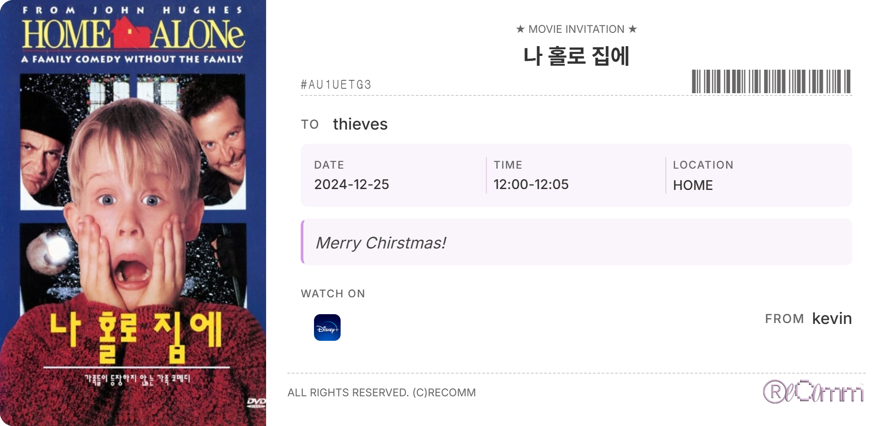

# 🍿 영화 추천 서비스 Recomm.



<br>

## 프로젝트 소개

- Recomm. 은 키워드를 기준으로 영화를 추천해주고, 영화에 대한 정보를 검색하 수 있는 사이트 입니다.
- 기존 영화 추천 알고리즘의 무한 스크롤의 경험을 탈피하고 과정 자체의 재미를 추구합니다.
- 티켓 생성하기 기능을 통해 함께 영화를 보고 싶은 사람에게 카카오톡으로 공유하고 일정을 캘린더에 저장할 수 있습니다.
- 영화에 좋아요를 누르거나 리뷰를 작성하여 다른 유저들과 소통할 수 있습니다.

<br>

## 👥 팀원 소개 및 역할 분담

본 프로젝트는 풀스택 개발 경험을 위해 기능별로 프론트엔드와 백엔드 역할을 교차하여 진행했습니다.

|               유한슬               |             이지은             |
| :--------------------------------: | :----------------------------: |
|  |  |
|                팀장                |              팀원              |

### 💡 협업 전략

- 특정 기능 개발 시 한 팀원이 백엔드를, 다른 팀원이 프론트엔드를 담당하여 풀스택 개발 경험을 쌓았습니다.
  - 기능 : 회원가입 / 댓글 / 영화 추천 / 티켓 CRUD / 티켓 공유
- 각자 맡은 파트의 개발이 완료되면 코드 리뷰를 통해 상호 피드백을 진행했습니다.
- 정기적인 회의를 통해 기능 구현 방향을 논의하고 설계를 함께 진행했습니다.

<br>

## 1. 개발 환경

- Front : HTML, CSS, Vue3,
- Back-end : Django, Sqlite3, TMDB API, KAKAO API
- 버전 및 이슈 관리 : GitLab
- 협업 툴: Notion, GoogleSheet, Mettermost
- 디자인 : Figma, Adobe Illustrator

<br>

## 2. 채택한 기술과 브랜치 전략

- Vue

  - 컴포넌트 기반 구조를 활용하여 header, footer 등 반복되는 UI 요소들을 재사용함으로써 개발 시간을 단축했습니다.
  - 양방향 데이터 바인딩(v-model)을 통해 form 요소들의 상태 관리를 효율적으로 구현할 수 있었습니다.
  - Single File Component 구조를 통해 template, script, style을 하나의 파일에서 관리하여 유지보수성을 높였습니다

- Git Flow
  - main 브랜치는 안정적인 버전만을 push하여 서비스의 신뢰성을 높였습니다.
  - develop 브랜치에서 개발을 진행하고 브랜치를 기능별로 나누어 일관된 개발 환경을 구성했습니다.
  - 기능별 브랜치는 accounts-model, signup-css 와 같이 기능 단위로 세분화하여 코드 충돌을 최소화했습니다.
  - develop 브랜치로의 merge 전 팀원 리뷰를 필수로 하여 충돌 가능성을 최소화 했습니다.

<br>

## 3. 개발 기간 및 작업 관리

### 개발 기간

전체 개발 기간 : 2024/11/18 ~ 2024/11/26

- 기능 구현 : 2024/11/18 ~ 2024/11/22
- UI 구현 : 2024/11/23 ~ 22024/11/26

### 작업 관리

> [작업관리 시트](https://docs.google.com/spreadsheets/d/1huh0pzInWA8SYiwbcZmCy_RytM8XCTWNxzq7IjM41ls/edit?usp=sharing)


- Google Sheet와 Mettermos를 이용하여 진행 상황을 공유했습니다.
- 매일 오전 9시, 오후 1시, 오후 5시 30분마다 회의를 진행하며 작업 우선순위와 진행 상황에 대해 공유하고 회의 내용을 정리했습니다.

<br>

## 4. 기획

### 🛠 기능 명세서 작성 (목표 서비스 구현 정도)

- View, 2Depth, 3Depth (+ more) 구조로 페이지를 계층화하고 각각의 컴포넌트(LoginView.vue, MovieDetail.vue 등)를 설계하여 체계적으로 기능구현 계획을 세웠습니다.
- 주요 기능별로 독립적인 컴포넌트를 구성하여 재사용성을 높이고 유지보수가 용이하도록 설계했습니다.


- 사용자(User) 기능

  - 회원가입/로그인: 이메일, 닉네임, 비밀번호를 통한 회원가입 및 로그인 구현
  - 회원정보 관리: 프로필 수정, 보안 질문 설정, 회원 탈퇴 기능 제공

- 영화(Movie) 서비스

  - 영화 검색: 제목, 장르별 영화 검색 및 필터링 기능
  - 상세 정보: 영화의 줄거리, 장르 등 정보 제공
  - 리뷰 시스템: 사용자들의 영화 리뷰 작성 및 댓글 등록

- 초대(Invitation) 시스템

  - 티켓 공유: 카카오톡을 통한 유저 생성 티켓 공유 기능
  - 초대장 생성: 상영 시간, 장소 정보를 포함한 맞춤형 초대장 제작

- 카카오(Kakao) 연동

  - 카카오 공유: 티켓/초대장 공유 기능
  - 구글 캘린더 저장: 손 쉬운 스케줄/약속 관리


<br>

> 달성률: 90% <br>
기확안을 상세하게 작성하여 기획했던 컴포넌트들은 모두 구현했습니다. 다만 세부 기능에서 티켓 폼에 상영시간을 넣으면 자동으로 시간을 계산해 주기 와 같은 작은 디테일들을 구현하지 못한 부분이 있습니다.

<br>

### ⚙️ ERD

ERD 설계

- Django 모델링을 통해 User, Movie, Review, Ticket 등 데이터 간의 관계를 명확히 정의하여 효율적인 데이터베이스를 구조화 했습니다.
- 테이블 간의 연관 관계를 시각화하고 필요한 필드와 외래키를 사전에 파악하여 안정적인 데이터 흐름을 만들고자 했습니다.


<br>

### 🖼️ Figma 와이어프레임

- 실제 개발을 시작하기 전 페이지 레이아웃과 컴포넌트 배치를 시각적으로 설계하여 개발 과정에서 혼돈을 최소화했습니다.
- 일관된 UI/UX를 구축하여 팀원간의 의사소통을 원활하게 진행할 수 있었습니다.


<br>


### 🤖 추천 알고리즘 기술적 설명

이 프로젝트는 **TMDB API**를 활용하여 다양한 영화를 추천하는 알고리즘을 구현하였습니다. 이 알고리즘은 주어진 **키워드**를 기반으로 영화 정보를 검색하고, 검색 결과를 필터링하여 사용자가 원하는 영화를 추천합니다.

### 1. **영화 검색**  
   - **제목 검색**: 사용자가 입력한 키워드로 제목을 검색하여 관련된 영화를 찾습니다.  
   - **키워드 검색**: TMDB API에서 제공하는 키워드 검색 기능을 활용하여, 사용자가 입력한 키워드에 맞는 영화들을 추가적으로 추천합니다.
   - **여러 키워드 검색**: 다수의 키워드를 사용하여 동시에 여러 영화를 검색할 수 있습니다. 여러 키워드가 포함된 영화를 추천하여 더 많은 선택지를 제공합니다.

### 2. **영화 필터링 및 정렬**  
   - **포스터 필터링**: 검색된 영화 중에서 **포스터**가 있는 영화만 필터링하여 사용자에게 보여줍니다.  
   - **정렬**: 영화는 최신 개봉일 순으로 정렬되어, 가장 최신 영화를 우선적으로 추천합니다.  
   - **중복 제거**: 여러 키워드를 사용하여 검색된 영화 중 중복된 항목은 제거하여 효율적인 결과를 제공합니다.

### 3. **상세 정보 제공**  
   - 영화의 상세 정보를 제공하기 위해, 각 영화에 대한 **credits (출연진)**, **OTT 제공처 (watch/providers)**, **관련 키워드 (keywords)** 등의 추가 정보를 가져옵니다. 이를 통해 사용자가 영화를 더 잘 이해하고 선택할 수 있도록 돕습니다.

### 4. **에러 처리 및 예외 처리**  
   - 각 API 요청에서 발생할 수 있는 **에러**를 처리하고, 예외 상황에서는 **대체 검색**을 제공하여 사용자가 실패한 요청으로 인해 불편함을 겪지 않도록 합니다.
   - 예를 들어, **영어로 검색**을 시도하여 결과를 보완하는 방식입니다.

### 5. **다양한 영화 추천 방식**  
   - **키워드 기반 검색** 외에도, **여러 키워드를 동시에 처리**하는 기능을 통해 다양한 추천을 할 수 있습니다. 이는 사용자가 더 구체적이고 다양한 선택지를 얻을 수 있도록 도와줍니다.

### 6. **추천 알고리즘의 동작 흐름**  
   1. 사용자가 입력한 키워드로 **영화 제목**을 검색합니다.
   2. 검색된 영화 중에서 **포스터가 있는 영화**만 필터링하여 보여줍니다.
   3. 사용자가 검색한 키워드와 관련된 **키워드 ID**를 찾고, 해당 ID를 이용해 **관련된 영화를 추가적으로 검색**합니다.
   4. 결과가 없는 경우 **영어 키워드**로 검색하여 대체 검색 결과를 제공합니다.
   5. 모든 영화 결과를 최신 개봉일 기준으로 **정렬**하여 추천합니다.
 


## 5. 주요 기능

### [랜딩]


- **3D 인터랙티브 로고**

  - 마우스 움직임에 반응하여 시각적 매력을 더한 인터랙션입니다.
  - 로고 클릭 시 **컨셉 설명 페이지**로 이동합니다.

- **컨셉 설명 페이지**
  - Recomm. 서비스가 추구하는 캐치프라이즈를 간략히 설명합니다.

<br>

### [회원가입 / 로그인]

- **커스텀 회원가입 폼**

  - `django_rest_auth` 기본 모델에 추가로 **nickname**, **sequrity_Q&A**, **profile_image** 필드를 커스텀하여 사용합니다.
  - **sequrity_Q&A**는 영화와 관련된 질문으로 구성됩니다.
  - 이메일 형식 검증, 비밀번호 일치 여부 확인 등 회원가입에 필요한 기능을 구현하였습니다.

- **유저 인증**
  - 유저네임과 비밀번호를 사용하여 로그인이 가능합니다.

<br>


### [영화 검색]


- **키워드 검색 페이지**  
  - 형용사, 제작사, 장르 등 기본 키워드를 제공하여 사용자가 손쉽게 영화 검색이 가능합니다.  
  - 키워드를 클릭하면 해당 키워드와 관련된 영화들이 **카드 형태**로 표시됩니다.  

- **상단 검색바**  
  - 어디서든 검색이 가능하며, 입력한 내용과 가장 유사한 결과를 반환합니다

<br>

### [영화 디테일]


- **영화 상세 정보 제공**  
  - **포스터**와 **정보 섹션**으로 구성되어 있습니다.  
  - **정보 섹션**에서는 영화의 제목, 장르, 줄거리, 시청 가능한 OTT 플랫폼 정보를 제공합니다.  

- **사용자 상호작용 기능**  
  - 해당 영화에 리뷰를 작성할 수 있습니다.  
  - 영화 초대장을 만들거나, 나중에 보기 위해 좋아요를 누를 수 있습니다.


<br>

### [Review]


- **리뷰 소통 기능**  
  - 디테일 페이지에서 **Review** 버튼을 누르면 다른 사용자와 소통할 수 있습니다.  
  - 문자 메시지처럼 구성된 레이아웃으로 직관적이고 편리한 인터페이스를 제공합니다.  
  - 각 댓글에 **작성 시간**이 표시되어 소통의 흐름을 쉽게 파악할 수 있습니다.  

- **유저 인터랙션**  
  - 재미있고 생동감 있는 상호작용으로 사용자 경험을 극대화합니다.

<br>

### [초대 카드]

- **티켓 생성 및 공유 기능**  
  - 사용자가 **카카오톡 친구 목록**에 있는 사람에게 영화를 공유할 수 있는 **티켓 생성** 기능을 제공합니다.  
  - 날짜, 시간, 장소, 메시지 등 사용자 맞춤 설정이 가능합니다.  
  - 해당 영화가 시청 가능한 OTT 플랫폼 정보도 함께 표시됩니다.  
  - 티켓을 공유받은 사람은 티켓에 표시된 정보대로 **이미지를 다운** 받거나 **구글 캘린더에 일정을 저장**할 수 있습니다.

<br>

### [개인 페이지]


- **유저의 좋아요 영화 목록 확인**  
    
  - 사용자가 좋아요를 눌렀던 영화 목록을 확인할 수 있습니다.  
  - 영화 목록은 **가로 스크롤** 형식으로 제공되어, 더 재미있는 탐색이 가능합니다.  
  - 각 영화 포스터를 클릭하면 해당 영화의 **디테일 페이지**로 이동하며, 좋아요를 다시 **토글**하여 목록에서 제거할 수 있습니다.


- **보낸 티켓 확인**  

    

  - 사용자가 만든 **티켓 이미지**가 아이폰 영역에 표시됩니다.
  - 스크롤을 하면 다음 티켓 이미지로 넘어갑니다.
  - 티켓 옆에 있는 **X 표시**를 클릭하면 해당 티켓을 삭제할 수 있습니다.


<br>

## 6. AI 활용
- TMDB API 를 이용하여 영화 정보를 불러오기 때문에 
 상단 영화 키워드 검색에서 검색 결과가 풍부한 키워드를 추천받았습니다.


- 그 후 검색 결과를 보여주는 알고리즘에서 영화에 설정된 키워드, 제목, 줄거리에서 해당 내용이 있는 영화를 반환하도록 요청했습니다.


#### 위 답변을 응용하여 검색 로직에 다음과 같이 활용했습니다.
> store/movie.js
```js
 // 포스터가 있는 영화만 필터링하는 함수
  const filterMoviesWithPoster = (movies) => {
    return movies.filter(movie => movie.poster_path !== null)
  }

  // 키워드 ID를 찾는 함수
  const findKeywordId = async (keyword) => {
    try {
      const response = await fetch(
        `https://api.themoviedb.org/3/search/keyword?query=${encodeURIComponent(keyword)}`,
        getOptions
      )
      const data = await response.json()
      return data.results[0]?.id
    } catch (err) {
      console.error('Error finding keyword:', err)
      return null
    }
  }

  // 키워드 ID로 영화를 검색하는 함수
  const fetchMoviesByKeywordId = async (keywordId) => {
    try {
      const response = await fetch(
        `https://api.themoviedb.org/3/discover/movie?with_keywords=${keywordId}&language=ko-KR&sort_by=release_date.desc`,
        getOptions
      )
      const data = await response.json()
      return filterMoviesWithPoster(data.results)
    } catch (err) {
      console.error('Error fetching movies by keyword:', err)
      return []
    }
  }
```

<br>

## 7. 프로젝트 후기

### 유한슬
erd를 기획하고 이를 바탕으로 백엔드를 구성하며 온전히 하나의 프로젝트를 이끌어 나가보는 경험이 큰 도움이 되었습니다. 이 과정에서 데이터를 읽는 방법을 배웠고, 데이터가 벡엔드와 프론트, DB로 어떻게 움직이는지 흐름을 눈에 익힐 수 있었습니다. 

비동기를 컨트롤하는 것이 쉽지는 않았으나, 프로젝트를 완성하면서 어느 정도 익숙해졌다고 생각합니다. 이 프로젝트를 통해 웹 프로젝트가 동작하는 전반적인 과정을 모두 직접 경험해 볼 수 있었다는 것이 가장 큰 학습이었으며, 앞으로의 프로젝트를 하는 데에 큰 밑거름이 될 것입니다.

### 이지은 
CSS 작업에서 생각보다 어려움을 겪었는데, 특히 클래스 이름을 동일하게 지정하면서 예기치 않은 충돌이 발생했던 점이 기억에 남습니다. 앞으로는 클래스 이름 설정에 더 세심하게 신경 써야겠다고 느꼈습니다. 그리고 요소들의 위치를 픽셀 단위로 조정했는데, 이를 대체할 더 효율적인 방법이 있을 것 같아 추후 공부해 볼 예정입니다. 

비록 어려움이 있었지만, 첫 프로젝트를 온전한 결과물로 마무리할 수 있어 정말 뿌듯합니다. 개발 과정에서 풀스택을 경험해 보며, 앞으로 다른 프로젝트도 잘 해낼 수 있겠다는 자신감이 생겼습니다. 다음 프로젝트에서는 하나의 기능을 도맡아 백엔드와 프론트엔드 양쪽 모두 깊이 있게 구현해보는 데 집중하고 싶습니다.